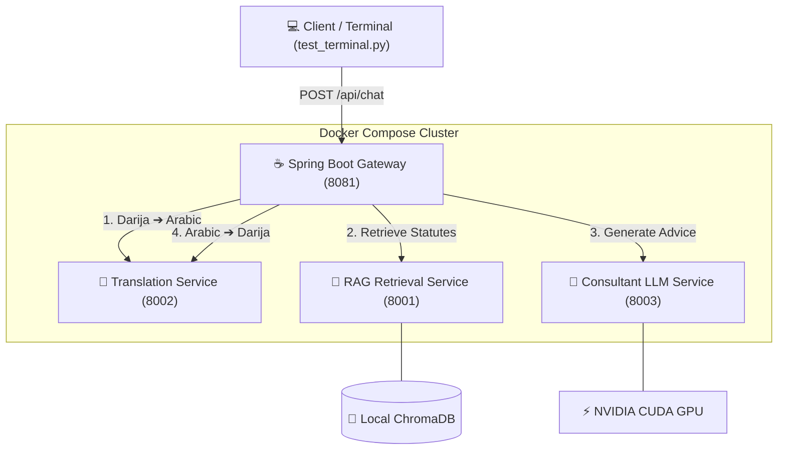

# 🇲🇦 Moroccan Legal AI Consultant (Darija RAG Chatbot)

An end-to-end, GPU-accelerated microservices architecture designed to provide accurate legal consultation based on the **Moroccan Moudawana (Family Law)**. The system allows users to ask complex legal questions in **Moroccan Darija**, retrieves relevant legal statutes using Retrieval-Augmented Generation (RAG), synthesizes an authoritative response using an open-source LLM, and translates the output back to Darija.

Crucially, the system features a dedicated terminal rendering pipeline that reshapes and inverts Arabic characters so they render cleanly in Latin-oriented Windows terminals.

---

## 🏗️ System Architecture

The project is structured into **4 decoupled microservices** orchestrated via Docker Compose:



1. **`Spring_back` (Port 8081):** Java 21 Spring Boot API Gateway. Acts as the central orchestrator routing requests through the translation, retrieval, and generation phases using reactive `WebClient`.
2. **`Service_traduction` (Port 8002):** Python FastAPI service powered by HuggingFace Helsinki-NLP models (`opus-mt-ar-en` / custom Darija adapters) to handle bidirectional translation between Moroccan Darija and Modern Standard Arabic (MSA).
3. **`Service_Rag` (Port 8001):** Python FastAPI vector retrieval service. Uses `langchain` and `chromadb` to embed and search legal texts (`moudawana_sample.txt`) via multilingual MiniLM embeddings.
4. **`Service_modèle_consultant` (Port 8003):** Python FastAPI LLM inference engine. Runs an open-source generative model (`Qwen/Qwen2-1.5B-Instruct`) accelerated directly on your local NVIDIA GPU.

---

## 🚀 Getting Started

### Prerequisites
- **Docker Desktop** installed and running on Windows / WSL2.
- **NVIDIA GPU** with updated drivers and CUDA Container Toolkit enabled in Docker Desktop.

### 1. Launch the Cluster
You no longer need to start individual scripts manually. The entire architecture boots with a single command:

```powershell
docker compose up -d --build
```
*(Note: On older Docker installations, use `docker-compose up -d --build`)*.

This command will:
- Build the optimized Docker images for all 4 microservices.
- Automatically download and configure CUDA PyTorch inside the LLM container.
- Mount the `./Service_Rag/Data` and `./Service_Rag/chroma_db` directories as persistent local volumes.

### 2. Verify Health
Wait ~1-2 minutes for the PyTorch weights and Spring Boot context to initialize. You can check container status in Docker Desktop or run:

```powershell
docker compose ps
```

---

## 🧪 Testing the Chatbot

A dedicated testing client (`test_terminal.py`) is provided at the root directory. This script sends a Darija prompt to the Spring Boot Gateway and automatically handles Windows console UTF-8 re-wrapping and right-to-left Arabic visual inversion.

```powershell
python test_terminal.py
```

### Example Interaction:
```text
User Query: ؟ﺔﻘﻔﻨﻟﺍ ﻲﻓ ﻖﺤﻟﺍ ﻭﺪﻨﻋ ﻥﻮﻜﺷ

--- Chatbot Response ---
.ﺔﻧﻭﺪﻤﻟﺍ ﺫﺎﻫ ﻡﺎﻜﺣﺃ ﻮﻘﺒﻄﻴﻛ ،ﺔﺑﺭﺎﻐﻤﻟﺍ ﻊﻣ ﻦﻴﻨﻛﺎﺳ ﻭﺃ ﺔﻴﺴﻨﺟ ﻝﺎﻳﺩ ﺓﺪﻋ ﻢﻫﺪﻨﻋ ﻲﺷﺎﻣ...
```
*(When rendered in your terminal, the inverted text above will display naturally from right-to-left as fluent Arabic script).*

---

## 📁 Managing RAG Knowledge Base

The legal knowledge base resides in `Service_Rag/Data/moudawana_sample.txt`. 

Because this folder is mounted as a Docker volume, you can update or add legal documents directly from your host filesystem. To re-ingest data into the vector database:

```powershell
docker compose exec service_rag python ingest.py
```

---

## 🛑 Shutting Down

To cleanly stop the cluster without losing your ChromaDB vector indexes:

```powershell
docker compose down
```
*(To completely wipe volumes and rebuild from scratch, add the `-v` flag: `docker compose down -v`)*.
